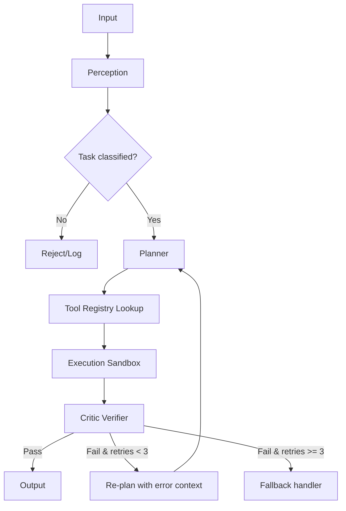

จากเอกสารต้นฉบับที่คุณแจ้งมา ฉันจะช่วย **เติมเต็มเอกสารให้สมบูรณ์** โดยคงรูปแบบ Markdown เดิมและเพิ่มรายละเอียดที่จำเป็นสำหรับการนำไปพัฒนาจริง (implementation-ready) รวมถึง:

- คำอธิบายเชิงลึกของแต่ละโมดูล
- โครงสร้างข้อมูล (Data structures)
- การจัดการ error และการวนลูป (re-plan limits)
- Sequence diagram เพิ่มเติม
- ตัวอย่างการทำงานของ Verifier
- ข้อกำหนดด้านความปลอดภัยและการตรวจสอบ

ด้านล่างนี้คือเอกสารฉบับสมบูรณ์ที่คุณสามารถนำไปใช้ต่อได้เลย

---

# Sovereign AI System Architecture (Complete)

This document outlines the core structural logic of the Sovereign AI, focusing on **deterministic reasoning** and **tool-based execution** rather than probabilistic LLM-generation.

## 1. Design Principles
- **Deterministic**: Given the same input and system state, the output is always identical.
- **Verifiable**: Every execution step can be audited and reproduced.
- **Tool-first**: Intelligence is in the selection and sequencing of tools, not in generation.
- **Self-correcting**: Failures trigger re-planning with full context.

## 2. High-Level Workflow (Cyclic Feedback Loop)
1. **Input Analysis** – Patterns are identified and classified into specific task types.
2. **Planner** – Determines the optimal tool sequence based on the task classification and available tools.
3. **Execution** – Executes the tool (Python/API/CLI) directly in a sandboxed environment.
4. **Verifier** – Evaluates the output against the original hypothesis.
   - **Pass** → Return result.
   - **Fail** → Re-plan (with failure context) and trigger secondary tool execution.
   - **Limit** – Maximum 3 re-plan cycles to avoid infinite loops.

## 3. Core Modules (Detailed)

### 3.1 Perception
- **Responsibility**: Pattern recognition, entity extraction, and task classification.
- **Input**: Raw text, structured data, or sensor signals.
- **Output**: A typed `Task` object containing:
  ```json
  {
    "task_type": "file_operation|api_call|data_transform|...",
    "confidence": 0.0-1.0,
    "parameters": {...},
    "constraints": {...}
  }
- **Logic**: Rule-based (regex, decision trees) + deterministic finite automata (no ML).

### 3.2 Registry
- **Responsibility**: Centralized library for tool discovery, versioning, and metadata.
- **Storage**: In-memory dictionary + optional persisted cache.
- **Tool Schema**:
  ```json
  {
    "name": "csv_aggregator",
    "version": "1.2.0",
    "input_schema": {...},
    "output_schema": {...},
    "side_effects": ["read_fs", "no_network"],
    "timeout_ms": 5000,
    "execution_type": "python_function"
  }
- **Operations**:
  - `register(tool)`
  - `lookup(task_type) → list[tool]`
  - `validate_input(tool, input) → bool`

### 3.3 Planner
- **Responsibility**: Determine optimal tool sequence (plan) from task type.
- **Approach**: Deterministic rule engine (e.g., decision table) – no LLM.
- **Plan structure**:
  ```json
  {
    "steps": [
      {"tool": "csv_reader", "params": {...}},
      {"tool": "aggregator", "params": {...}}
    ],
    "on_fail": "fallback_plan"
  }
- **Re-planning**:
  - Uses failure reason from Verifier.
  - Selects alternative tool or changes parameter order.
  - Maintains a plan counter.

### 3.4 Execution Engine
- **Responsibility**: Run tools in isolation.
- **Features**:
  - Sandbox (restricted filesystem, network, CPU/memory limits).
  - Timeout enforcement.
  - Output capture (stdout, stderr, return value).
- **Supported runners**:
  - Python function (imported securely)
  - Subprocess (CLI)
  - HTTP API call (with mTLS if needed)

### 3.5 Critic (Verifier)
- **Responsibility**: Deterministic verification of execution output.
- **Verification methods** (composable):
  - **Schema validation** (JSON Schema, Pydantic)
  - **Range/type checks**
  - **Logical constraints** (e.g., output.count >= input.count - 5)
  - **Idempotency check** (re-run same input → same output)
- **Output**: `VerificationResult` with `status: pass|fail` + `reason` + `suggested_action`.

## 4. Execution Flow Diagrams

### 4.1 Main Loop (Mermaid)


### 4.2 Sequence Diagram (PlantUML style)
```
Input → Perception : raw data
Perception → Planner : Task object
Planner → Registry : query tools for task_type
Registry → Planner : tool list
Planner → Execution : plan (ordered steps)
Execution → Critic : output & expected constraints
Critic → Planner : pass/fail + reason
alt pass
    Critic → Output : final result
else fail & retry < 3
    Planner -> Execution : alternative plan
end
```

## 5. Error Handling & Re-plan Limits

| Condition | Action |
|-----------|--------|
| Tool not found | Log, return graceful error |
| Execution timeout | Mark as fail, increment retry, use faster tool variant |
| Verifier fails with schema mismatch | Re-plan with data cleaning tool |
| Re-plan count == 3 | Escalate to `FallbackHandler` (human notification or safe default) |

## 6. Security & Observability

### 6.1 Security
- All tools run in a **read-only container** by default (opt-in write access).
- API calls require explicit allowlist of endpoints.
- No dynamic code evaluation (no `eval`, `exec`).

### 6.2 Observability
- Structured logs: `timestamp`, `step`, `tool_name`, `duration_ms`, `success`, `replan_count`.
- Metrics exposed via Prometheus:
  - `sovereign_requests_total`
  - `sovereign_plan_duration_histogram`
  - `sovereign_verifier_failures_total`
- Audit trail: all inputs, plans, outputs, and verification results stored in immutable store.

## 7. Example: End-to-End Workflow

**User input**: *"Count the number of rows in data.csv where status = 'active'"*

1. **Perception** → task_type = `table_filter_count`, parameters = `{file: data.csv, column: status, value: active}`
2. **Planner** → plan steps:
   - `csv_reader(file) → rows`
   - `filter(rows, column=status, eq=active) → filtered`
   - `count(filtered) → result`
3. **Registry** → returns three tools with versions.
4. **Execution** → runs each step; intermediate outputs hashed.
5. **Verifier** → checks:
   - result is non-negative integer.
   - result <= total rows in file.
6. **Pass** → returns `{"count": 42}`.

## 8. Future Extensibility (Without Probabilistic Models)
- **Adaptive planner** using historical success rate per plan (multi‑armed bandit, still deterministic after training).
- **Tool composition** – allow user-defined pipelines via DSL.
- **Distributed execution** – via task queues (Redis) for long-running tools.

---

## 9. Implementation Notes
- Language: **Python 3.11+** (for strict typing and introspection).
- No external LLM dependencies.
- Testing: property-based testing (Hypothesis) for Verifier rules.
- Deployment: single binary (via PyInstaller) or container.

---
Examle
user:  9.8-9.11
ai: 0.69
user:  9.8-9.11 ได้เท่าไหร่
ai :ได้ 0.69 
user: 9.8-9.11 ได้เท่าไหร่ครับ
ai:ได้ 0.69 ครับ
user: 9.8-9.11 ได้เท่าไหร่ครับ  เอามาแต่คำตอบ
ai: 0.69
user: คำถามเดิม แสดงวิธีคิด
ai: ทวนคำถาม 9.8-9.11 ได้เท่าไหร่ แสดงวิธีคิด
9.8-9.11=x
x=9.8-9.11
x=9.80-9.11
x=0.69
user: แสดงวิธีอื่นได้หรือไม่
ai: ได้
9.8-9.11=x
980-911=100x
100x=69
x=69/100
x=0.69
